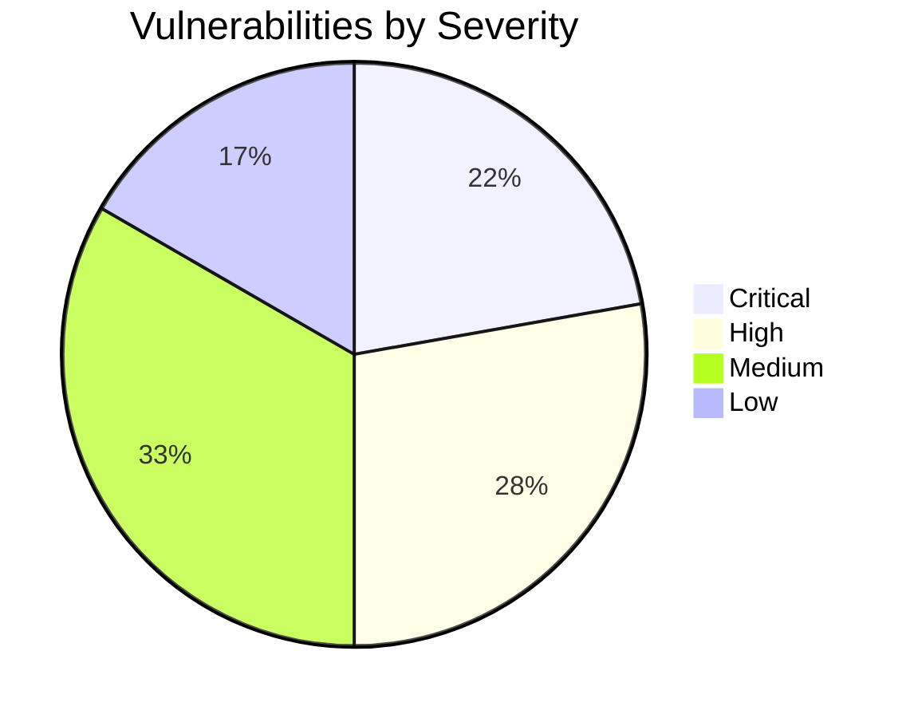
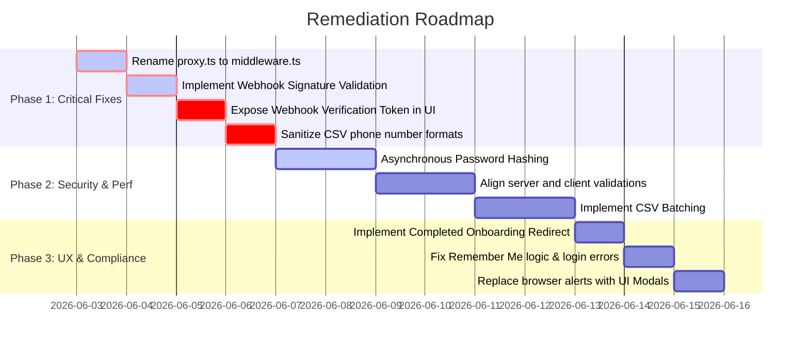

# UI & System Audit Report: Send Signal Onboarding Flow

This audit report evaluates the system and user interface of the **Send Signal** application from the public marketing landing page, through the authentication pages, to the multi-step onboarding wizard.

---

## 1. Executive Summary

A comprehensive code and architectural audit was performed on the Send Signal workspace, focusing on pages and logic from `/` (marketing landing page) to `/onboarding` (onboarding wizard). 

The audit identified several **critical** and **high-severity** vulnerabilities across security, performance, state management, and API compliance. 

### Key Findings:
- **Security**: The Next.js routing middleware is completely inactive because of a naming discrepancy, leaving routes unprotected. Webhook handlers accept unauthenticated payloads without signature verification. Client-side registration constraints (email domain checks and password complexity) are missing on the server.
- **Performance**: In-memory parsing of large CSV files risks freezing user browsers, while unbatched bulk database inserts through Next.js Server Actions expose the system to timeout errors and DB connection depletion.
- **Compliance**: Lead imports automatically set `opt_in: true` for all records without verification or layout options, creating risk under WhatsApp's Business API policy. Strict regex phone validation silently drops typical CSV number formats.

---

## 2. Vulnerability Register

| ID | Component / Page | Vulnerability Description | Category | Severity |
| :--- | :--- | :--- | :--- | :--- |
| **SS-01** | [proxy.ts](file:///c:/Users/dell/OneDrive/Desktop/Send%20Signal/src/proxy.ts) | **Inactive Next.js Routing Middleware** (Wrong filename) | Security | **CRITICAL** |
| **SS-02** | [route.ts (Webhook)](file:///c:/Users/dell/OneDrive/Desktop/Send%20Signal/src/app/api/webhooks/whatsapp/route.ts#L49-L97) | **No WhatsApp Signature Verification** (Payload forging) | Security | **CRITICAL** |
| **SS-03** | [onboarding-wizard-client.tsx](file:///c:/Users/dell/OneDrive/Desktop/Send%20Signal/src/app/onboarding/onboarding-wizard-client.tsx) | **Unusable Webhooks** (Webhook verification token never exposed) | Logic / UX | **CRITICAL** |
| **SS-04** | [lead.ts (Action)](file:///c:/Users/dell/OneDrive/Desktop/Send%20Signal/src/lib/actions/lead.ts#L66-L110) & [onboarding-wizard-client.tsx](file:///c:/Users/dell/OneDrive/Desktop/Send%20Signal/src/app/onboarding/onboarding-wizard-client.tsx#L107-L113) | **Phone Format Validation Failures** (Typical CSV formats fail regex and drop) | Compliance / UX | **CRITICAL** |
| **SS-05** | [auth.ts (Action)](file:///c:/Users/dell/OneDrive/Desktop/Send%20Signal/src/lib/actions/auth.ts#L9-L57) | **Bypassable Client-Side Email Domain Filtering** | Security | **HIGH** |
| **SS-06** | [auth.ts (Validation)](file:///c:/Users/dell/OneDrive/Desktop/Send%20Signal/src/lib/validations/auth.ts#L8-L12) | **Weak Password Server Validation** (Bypassable complexity check) | Security | **HIGH** |
| **SS-07** | [crypto.ts](file:///c:/Users/dell/OneDrive/Desktop/Send%20Signal/src/lib/auth/crypto.ts#L6-L28) | **Synchronous Password Hashing Blocks Server Event Loop** | Performance / DoS | **HIGH** |
| **SS-08** | [onboarding-wizard-client.tsx](file:///c:/Users/dell/OneDrive/Desktop/Send%20Signal/src/app/onboarding/onboarding-wizard-client.tsx#L35) | **In-Memory CSV Storage & Timeout Risk** (Large file crashes) | Performance | **HIGH** |
| **SS-09** | [onboarding-wizard-client.tsx](file:///c:/Users/dell/OneDrive/Desktop/Send%20Signal/src/app/onboarding/onboarding-wizard-client.tsx#L415-L433) | **Step Navigation Guard Rails Missing** (Skip CSV Import) | Logic / UX | **HIGH** |
| **SS-10** | [crypto.ts](file:///c:/Users/dell/OneDrive/Desktop/Send%20Signal/src/lib/auth/crypto.ts#L34-L36) | **Insecure Static Salt for Session Tokens** | Security | **MEDIUM** |
| **SS-11** | [lead.ts (Action)](file:///c:/Users/dell/OneDrive/Desktop/Send%20Signal/src/lib/actions/lead.ts#L80) | **Automatic Opt-In Compliance Violation** | Compliance | **MEDIUM** |
| **SS-12** | [register/page.tsx](file:///c:/Users/dell/OneDrive/Desktop/Send%20Signal/src/app/%28auth%29/register/page.tsx#L29-L31) | **Conflicting Metadata/Title Flash** | Performance / UX | **MEDIUM** |
| **SS-13** | [auth.ts (Action)](file:///c:/Users/dell/OneDrive/Desktop/Send%20Signal/src/lib/actions/auth.ts#L82-L95) | **Timing Attack for User Email Enumeration** | Security | **MEDIUM** |
| **SS-14** | [login/page.tsx](file:///c:/Users/dell/OneDrive/Desktop/Send%20Signal/src/app/%28auth%29/login/page.tsx#L37-L41) | **Dummy/Non-functional "Remember Me" Checkbox** | Security / UX | **MEDIUM** |
| **SS-15** | [onboarding/page.tsx](file:///c:/Users/dell/OneDrive/Desktop/Send%20Signal/src/app/onboarding/page.tsx) | **Missing Completed Onboarding Redirect** | UX / Logic | **MEDIUM** |
| **SS-16** | [login/page.tsx](file:///c:/Users/dell/OneDrive/Desktop/Send%20Signal/src/app/%28auth%29/login/page.tsx) | **Sticky Errors on Uncontrolled Inputs** | State / UX | **LOW** |
| **SS-17** | [onboarding-wizard-client.tsx](file:///c:/Users/dell/OneDrive/Desktop/Send%20Signal/src/app/onboarding/onboarding-wizard-client.tsx#L101) | **Blocking Native Browser alerts** | UX | **LOW** |
| **SS-18** | [page.tsx (Public)](file:///c:/Users/dell/OneDrive/Desktop/Send%20Signal/src/app/%28public%29/page.tsx) | **Dead Landing Page Anchor Links** (Features, Pricing) | UX | **LOW** |

---

## 3. Detailed Vulnerability Analyses

### Critical Severity

#### SS-01: Inactive Next.js Routing Middleware
> [!CAUTION]
> **Vulnerability Type**: Security  
> **Impact**: All Route Protections Bypassed  
> **Location**: [src/proxy.ts](file:///c:/Users/dell/OneDrive/Desktop/Send%20Signal/src/proxy.ts)

- **Description**: The file handling route checking, redirects, and authentication checks is named `proxy.ts`. In Next.js (App Router), middleware must reside in a file named `middleware.ts` (or `.js`) in the root of the workspace or in the `src` directory. 
- **Consequence**: Next.js completely ignores `src/proxy.ts`. No routing middleware runs. Authenticated users can access the `/login` and `/register` routes directly, bypassing session checks. Unauthenticated users are not redirected from dashboard paths (although layout checks prevent component mounting, they are not handled at the routing layer).
- **Remediation**: Rename `src/proxy.ts` to `src/middleware.ts` so Next.js registers it.

---

#### SS-02: No WhatsApp Signature Verification
> [!CAUTION]
> **Vulnerability Type**: Security  
> **Impact**: Remote State Manipulation & Analytics Poisoning  
> **Location**: [src/app/api/webhooks/whatsapp/route.ts#L49-L97](file:///c:/Users/dell/OneDrive/Desktop/Send%20Signal/src/app/api/webhooks/whatsapp/route.ts#L49)

- **Description**: The webhook handler for Meta WhatsApp incoming notifications (`POST` requests) processes message status updates (read, delivered, replied) and inbound messages directly without validating their signatures. Meta signs webhook payloads using the `X-Hub-Signature-256` header (containing a SHA-256 HMAC generated using the App Secret).
- **Consequence**: Anyone can post fake events to `/api/webhooks/whatsapp` to spoof inbound messages, mark users as unsubscribed, change campaigns statuses, and destroy analytics.
- **Remediation**: Implement a helper function to verify the HMAC signature header using `crypto.createHmac` and the stored `APP_SECRET` before routing updates.

---

#### SS-03: Unusable Webhooks (Leakage of Webhook Verify Token)
> [!CAUTION]
> **Vulnerability Type**: Logic / UX  
> **Impact**: Unable to Configure Meta WhatsApp Integration  
> **Location**: [src/app/onboarding/onboarding-wizard-client.tsx](file:///c:/Users/dell/OneDrive/Desktop/Send%20Signal/src/app/onboarding/onboarding-wizard-client.tsx) & [src/lib/actions/whatsapp.ts](file:///c:/Users/dell/OneDrive/Desktop/Send%20Signal/src/lib/actions/whatsapp.ts#L24)

- **Description**: When connecting a WhatsApp account, the server generates a cryptographically random `webhook_verify_token` if one is not provided. This token is encrypted and written to the database. However, this token is **never returned** or shown to the user on the screen. 
- **Consequence**: Since the verify token is hidden in the database, the user cannot copy it to configure the Webhook endpoint in the Meta Developer Console. The developer verification challenge will fail, rendering webhooks unusable.
- **Remediation**: Expose the verification token on the screen at Step 4 of the Onboarding Wizard (or settings page) so users can copy it.

---

#### SS-04: Phone Format Validation Failures
> [!CAUTION]
> **Vulnerability Type**: Compliance / UX  
> **Impact**: Silent Data Loss (CSV Leads Discarded)  
> **Location**: [src/lib/actions/lead.ts#L66-L110](file:///c:/Users/dell/OneDrive/Desktop/Send%20Signal/src/lib/actions/lead.ts#L66) & [src/app/onboarding/onboarding-wizard-client.tsx#L107-L113](file:///c:/Users/dell/OneDrive/Desktop/Send%20Signal/src/app/onboarding/onboarding-wizard-client.tsx#L107)

- **Description**: The database validator uses `phoneRegex = /^\+?[1-9]\d{1,14}$/` to validate leads. This regex strictly rejects spaces, dashes, dots, and parentheses. Typical CSV exports from CRMs format numbers as `+1 (555) 019-2834` or `07911-123456`. The client does not sanitize the input, and the server rejects any mismatch, returning a `failed` count.
- **Consequence**: Imported records are silently discarded during validation. The user is told "Skipped X invalid rows" but is given no hint that the punctuation caused the failure.
- **Remediation**: Strip all formatting punctuation (spaces, dashes, parentheses) in the client mapping code before submission: `phone.replace(/[\s\-\(\)\.]/g, '')`.

---

### High Severity

#### SS-05: Bypassable Client-Side Email Domain Filtering
> [!WARNING]
> **Vulnerability Type**: Security  
> **Impact**: Weak/Personal Account Spam  
> **Location**: [src/lib/actions/auth.ts#L9-L57](file:///c:/Users/dell/OneDrive/Desktop/Send%20Signal/src/lib/actions/auth.ts#L9)

- **Description**: The registration page validates that emails do not end in `gmail.com` or `yahoo.com`. However, the server action `registerUser` only runs a basic Zod `.email()` parser without checking domain extensions.
- **Consequence**: Anyone can use automated API requests or simple scripts to bypass the client UI and register with personal Gmail/Yahoo addresses.
- **Remediation**: Enforce email domain rules inside the server action or Zod schema using `z.string().refine()`.

---

#### SS-06: Weak Password Server Validation
> [!WARNING]
> **Vulnerability Type**: Security  
> **Impact**: Vulnerable Accounts (Brute Force Targets)  
> **Location**: [src/lib/validations/auth.ts#L8-L12](file:///c:/Users/dell/OneDrive/Desktop/Send%20Signal/src/lib/validations/auth.ts#L8)

- **Description**: The client component checks that passwords contain at least one uppercase letter, one digit, and one special character. The server validation (`RegisterSchema`) only verifies `password.min(8)`.
- **Consequence**: Weak passwords (e.g. `12345678`, `password`) can bypass client checks and be saved in the database, leaving user accounts highly vulnerable to credential-stuffing attacks.
- **Remediation**: Align Zod validation on the server to match the client checks.

---

#### SS-07: Synchronous Password Hashing Blocks Server Event Loop
> [!WARNING]
> **Vulnerability Type**: Performance / DoS  
> **Impact**: Application Unresponsiveness Under Traffic  
> **Location**: [src/lib/auth/crypto.ts#L6-L28](file:///c:/Users/dell/OneDrive/Desktop/Send%20Signal/src/lib/auth/crypto.ts#L6)

- **Description**: Password hashing (`hashPassword`) and verification (`verifyPassword`) utilize Node's `scryptSync` (synchronous). Hashing is highly CPU-intensive by design.
- **Consequence**: Running it synchronously blocks the Node.js main execution thread for 100ms+ per verification. Multiple simultaneous login requests will freeze the server, causing all other requests to time out.
- **Remediation**: Refactor authentication to use asynchronous hashing (e.g., `scrypt` callback wrapped in a Promise or libraries like `bcrypt`/`argon2`).

---

#### SS-08: In-Memory CSV Storage & Timeout Risk
> [!WARNING]
> **Vulnerability Type**: Performance  
> **Impact**: Browser Tab Crashes & Server timeouts  
> **Location**: [src/app/onboarding/onboarding-wizard-client.tsx#L35](file:///c:/Users/dell/OneDrive/Desktop/Send%20Signal/src/app/onboarding/onboarding-wizard-client.tsx#L35) & [src/lib/actions/lead.ts#L96-L103](file:///c:/Users/dell/OneDrive/Desktop/Send%20Signal/src/lib/actions/lead.ts#L96)

- **Description**: Large parsed CSV datasets are stored entirely in a React component state array (`csvData`), which is passed en-masse to `importLeads`. The server writes these leads in one massive query (`prisma.lead.createMany`).
- **Consequence**: Files with thousands of rows will crash the browser tab or hit database request timeouts, leaving the onboarding wizard in a hung state.
- **Remediation**: Implement client-side pagination/chunking to upload leads in batches of 500-1000, displaying a progress bar.

---

#### SS-09: Step Navigation Guard Rails Missing
> [!WARNING]
> **Vulnerability Type**: Logic / UX  
> **Impact**: Incomplete Onboarding Funnel  
> **Location**: [src/app/onboarding/onboarding-wizard-client.tsx#L415-L433](file:///c:/Users/dell/OneDrive/Desktop/Send%20Signal/src/app/onboarding/onboarding-wizard-client.tsx#L415)

- **Description**: The multi-step wizard allows users to click the "Next" button in Step 3 (CSV Import) without uploading or mapping any leads. 
- **Consequence**: The wizard lets the user advance to Step 4 (Summary) and complete onboarding with an empty database.
- **Remediation**: Disable the "Next" button in Step 3 until a CSV has been imported successfully (`csvStep === 'DONE'`).

---

### Medium Severity

#### SS-10: Insecure Static Salt for Session Tokens
> [!NOTE]
> **Vulnerability Type**: Security  
> **Impact**: Token Hashing Compromised  
> **Location**: [src/lib/auth/crypto.ts#L34-L36](file:///c:/Users/dell/OneDrive/Desktop/Send%20Signal/src/lib/auth/crypto.ts#L34)

- **Description**: The `hashToken` function hashes session cookies using a hardcoded static salt: `"send-signal-session"`. 
- **Consequence**: If the database is compromised, attackers can use precomputed rainbow tables to easily cracking hashes and hijack sessions.
- **Remediation**: Use a dynamic or environmental secret salt variable for session token hashing.

---

#### SS-11: Automatic Opt-In Compliance Violation
> [!NOTE]
> **Vulnerability Type**: Compliance  
> **Impact**: Unwanted Messages & Account Suspension Risk  
> **Location**: [src/lib/actions/lead.ts#L80](file:///c:/Users/dell/OneDrive/Desktop/Send%20Signal/src/lib/actions/lead.ts#L80)

- **Description**: When importing leads from a CSV, the server action automatically hardcodes `opt_in: true`. 
- **Consequence**: Imports do not respect checkmarks or consent indicators, violating opt-in compliance guidelines.
- **Remediation**: Add a layout checkbox to the mapping wizard asking users to confirm opt-in consent before completing imports.

---

#### SS-12: Conflicting Metadata/Title Flash
> [!NOTE]
> **Vulnerability Type**: Performance / UX  
> **Impact**: Document Title Flickering  
> **Location**: [src/app/(auth)/register/page.tsx#L29-L31](file:///c:/Users/dell/OneDrive/Desktop/Send%20Signal/src/app/%28auth%29/register/page.tsx#L29)

- **Description**: The page title is set using client-side `useEffect` and inline `<title>` tags instead of the Next.js `metadata` object.
- **Consequence**: The page title flickers during loading, causing a minor layout/UI visual glitch.
- **Remediation**: Export a standard `metadata` object from the page.

---

#### SS-13: Timing Attack for User Email Enumeration
> [!NOTE]
> **Vulnerability Type**: Security  
> **Impact**: Email Enumeration  
> **Location**: [src/lib/actions/auth.ts#L82-L95](file:///c:/Users/dell/OneDrive/Desktop/Send%20Signal/src/lib/actions/auth.ts#L82)

- **Description**: In the login flow, password matching is skipped if the user is not found, resulting in a fast response (~3ms) compared to matches (~150ms).
- **Consequence**: Attackers can query the endpoint to check if specific email addresses are registered users.
- **Remediation**: Run a dummy scrypt verification call even if the user is not found to normalize execution times.

---

#### SS-14: Dummy/Non-functional "Remember Me" Checkbox
> [!NOTE]
> **Vulnerability Type**: Security / UX  
> **Impact**: Confusing Session Behaviors  
> **Location**: [src/app/(auth)/login/page.tsx#L37-L41](file:///c:/Users/dell/OneDrive/Desktop/Send%20Signal/src/app/%28auth%29/login/page.tsx#L37)

- **Description**: The "Remember for 30 days" checkbox is not bound to a form parameter, but sessions default to 30 days.
- **Consequence**: Sessions always last 30 days, creating a security issue on shared devices.
- **Remediation**: Pass checkbox value in the login action and adjust cookie expiration times accordingly.

---

#### SS-15: Missing Completed Onboarding Redirect
> [!NOTE]
> **Vulnerability Type**: UX / Logic  
> **Impact**: Users Can Rerun Onboarding Wizard  
> **Location**: [src/app/onboarding/page.tsx](file:///c:/Users/dell/OneDrive/Desktop/Send%20Signal/src/app/onboarding/page.tsx)

- **Description**: The onboarding page does not check if the user has already connected a WhatsApp account or uploaded leads.
- **Consequence**: Users who already configured their setup can navigate back to the page and overwrite existing accounts.
- **Remediation**: Redirect users to the dashboard if a WhatsApp account is already associated with their profile.

---

### Low Severity

#### SS-16: Sticky Errors on Uncontrolled Inputs
> [!TIP]
> **Vulnerability Type**: State / UX  
> **Impact**: Outdated Validation Errors Remain Visible  
> **Location**: [src/app/(auth)/login/page.tsx](file:///c:/Users/dell/OneDrive/Desktop/Send%20Signal/src/app/%28auth%29/login/page.tsx)

- **Description**: Uncontrolled input values do not clear error state flags on change.
- **Remediation**: Bind the input values and clear state errors when typing.

---

#### SS-17: Blocking Native Browser Alerts
> [!TIP]
> **Vulnerability Type**: UX  
> **Impact**: Inconsistent UI Aesthetics  
> **Location**: [src/app/onboarding/onboarding-wizard-client.tsx#L101](file:///c:/Users/dell/OneDrive/Desktop/Send%20Signal/src/app/onboarding/onboarding-wizard-client.tsx#L101)

- **Description**: Uses native, blocking `alert()` calls, disrupting the design layout.
- **Remediation**: Implement a clean React toast or inline notifications.

---

#### SS-18: Dead Landing Page Anchor Links
> [!TIP]
> **Vulnerability Type**: UX  
> **Impact**: Links Don't Navigate Anywhere  
> **Location**: [src/app/(public)/page.tsx](file:///c:/Users/dell/OneDrive/Desktop/Send%20Signal/src/app/%28public%29/page.tsx)

- **Description**: Features, Use Cases, and Pricing links point to page sections that are missing on the landing page.
- **Remediation**: Remove links or add corresponding layout sections to the page.

---

## 4. Remediation Priority Roadmap

